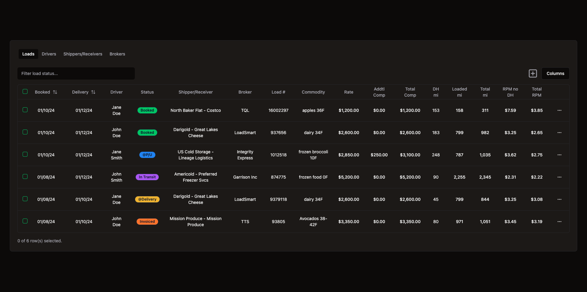

# TMS

A transportation management system (TMS) - users can log in to view, create, update, & delete freight delivery loads

**Link to project:** https://tms-table.vercel.app

## 🚀 How It's Made:

**Tech used:** This is a [Next.js](https://nextjs.org/) project bootstrapped with [`create-next-app`](https://github.com/vercel/next.js/tree/canary/packages/create-next-app) + [React](https://react.dev/), [Tailwind CSS](https://tailwindcss.com/), [shadcn/ui](https://ui.shadcn.com/), [Supabase](https://supabase.com/), [Vercel](https://vercel.com/)

## 🧞 Commands

All commands are run from the root of the project, from a terminal:

| Command         | Action                                           |
| :-------------- | :----------------------------------------------- |
| `npm i`         | Installs dependencies                            |
| `npm run dev`   | to start Next.js in development mode             |
| `npm run build` | to build the application for production usage    |
| `npm start`     | to start a Next.js production server             |
| `npm run lint`  | to set up Next.js' built-in ESLint configuration |
| `npx next -h`   | to get a list of the available CLI commands      |
